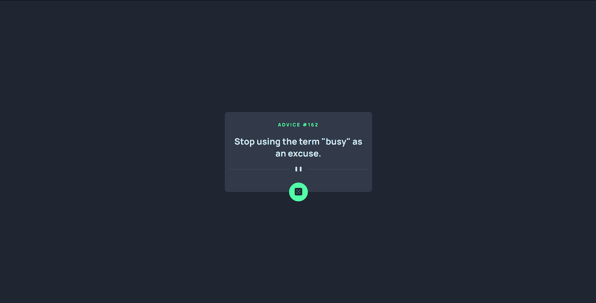
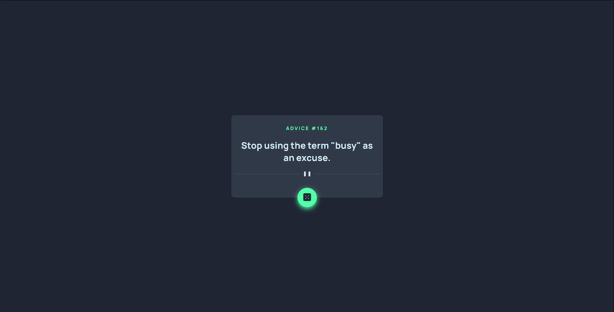
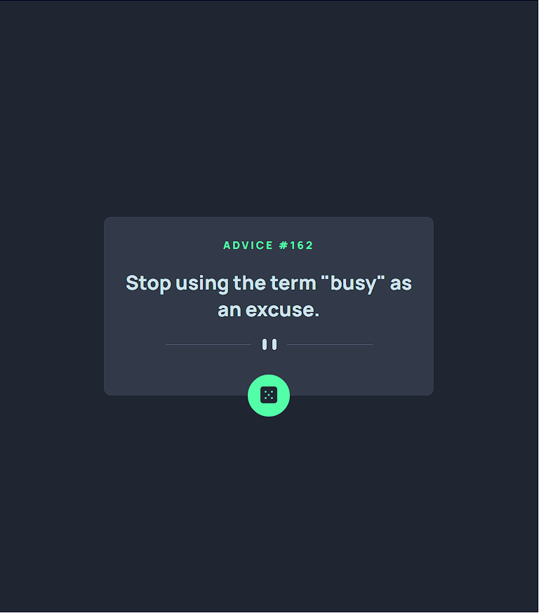

# Frontend Mentor - Advice generator app solution

This is a solution to the [Advice generator app challenge on Frontend Mentor](https://www.frontendmentor.io/challenges/advice-generator-app-QdUG-13db).

## Overview

### Screenshot

The project is an advice generator using Advice Slip API to generate random quotes of advice.

### Links

- Solution URL: [Advice generator](https://7wall.github.io/advice-generator-app/)

## My process

### Built with

- HTML5
- CSS
- Flexbox
- JavaScript
- Fetch
- API

### What I learned

In this project I improved my research and programming skills as well as applied the use of newly learned knowledge like Fetch to use API

## Author

- Github - [Wallison Viana](https://github.com/7Wall)
- Frontend Mentor - [@7Wall](https://www.frontendmentor.io/profile/7Wall)
